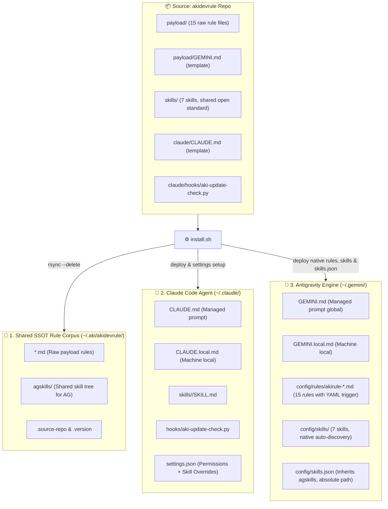

# akidevrule

One install command turns a fresh environment into Aki's full working baseline — for **both Claude Code and Antigravity/Gemini**, generated from one agent-neutral source: a shared rule corpus that loads itself at the right moment, plus a small set of sharp, single-purpose skills.

```bash
curl -fsSL https://raw.githubusercontent.com/lacvietanh/akidevrule/master/install.sh | bash
```

Also available: `bash install.sh` from a local checkout, or the docs-site wrapper `curl -fsSL https://dev.akitao.com/claudedoc/install.sh | bash`. The script is intentionally simple — inspect it before running.

This Git repository is the source of truth; `dev.akitao.com` is the presentation layer. Edit here, run the installer, done. It is **not** an auto-updater, daemon, package manager, or control plane.

## What you get

### Seven skills

| Skill | Invoke | Purpose |
|---|---|---|
| `akirule` | automatic, every conversation | Smart rule router — loads core rules always, contextual rules on signal match, everything on `nạp full` / `load all rules`. Hidden from the `/` menu by design. |
| `akiflow` | `/akiflow` | Lead-coordinated **agent council** for work needing more than one kind of judgment. It exists to settle hard questions itself so the owner does not have to: the lead decomposes the request into owned work items, checks a three-condition activation gate, convenes a named roster in one batch, and escalates only what neither the room nor the lead can settle — as a decision, never as an open question. Every specialist carries a mandatory first-principles + critical-thinking floor. Mechanism follows the shortfall: fork for continuity, clean subagent for independence, cheap model for bandwidth. The run lives in a self-pruning workspace under `~/.aki/agent-council/` (agent files + `chat.md` room + lead-owned checklist). Analysis and execution are separate phases with an explicit decision gate; verification is forked, adversarial review never is. An orthogonal `mode=audit` track fans out one read-only agent per rule domain. Design record: [`docs/arch/akiflow.md`](docs/arch/akiflow.md). |
| `akithink` | `/akithink` | Structured deep-thinking session for big, hard-to-reverse, or goal-ambiguous decisions: restate → goal excavation → first principles → mandatory critique → convergence into a `docs/` decision record. Recommends a top-tier model (Opus/Fable). |
| `akihtmlreport` | `/akihtmlreport` | Distills a dense analysis already in the conversation into one self-contained, ultra-wide `REPORT.html` at the project root — no new analysis, no dropped detail — then opens it locally. Exactly one per project; asks before overwriting. |
| `akihelp` | `/akihelp` | Live introduction to the whole installed Aki system, rendered by reading `index.md` and skill frontmatters at runtime — it can never go stale. |
| `akigitcommit` | `/akigitcommit` | Turns a messy working tree into a few clean, logically grouped Conventional Commits. Triages a half-finished tree first — finished vs mid-edit vs abandoned vs accidental, asking rather than guessing — then stages by explicit path, never `git add -A`, never pushes unasked. |
| `aki-article-writer` | `/aki-article-writer` or natural language | Per-project article writing pipeline: research & fact-verification, SEO metadata, JSON-LD schema, UX-psychology-aware content, and a dedicated Image Scout subagent (Gemini Flash / Haiku) for search → download → visual inspection → ffmpeg processing → slug-named WebP output. One subagent per article; image work is always isolated to a separate lightweight subagent. |

### A rule corpus that routes itself

`payload/` files follow a strict naming convention:

- `RULE-*.md` — constraints: what the agent must or must not do (behavior, coding, design/patterns, docs, content, stacks — Nuxt/Cloudflare + Tauri, UI, SEO, release, DB design, business/market).
- `METHOD-*.md` — analytical frameworks: how to reason through a specific class of problem. Heavy, loaded only when the task is genuinely analytical.
- `index.md` — file manifest, precedence order, project-binding policy.

`akirule` routes them in three tiers, with deliberately high sensitivity (err toward loading — a false positive costs a few tokens, a false negative causes wrong behavior):

- **Tier 1 — Core, hard-embedded every conversation:** `index.md`, `RULE-agent-behavior.md`, `RULE-coding.md`.
- **Tier 2 — Contextual, read on signal match:** the constraint rules `RULE-design-core.md` (loaded high-sensitivity — any structural/decomposition decision), `RULE-docs.md` (structure and lifecycle, plus the docs-vs-code drift audit), `RULE-content-write.md`, `RULE-stack-akiNuxtCf.md`, `RULE-stack-tauri.md` (Tauri v2 + Rust: never-block-the-UI, version SSOT, target context), `RULE-ui-pattern.md`, `RULE-seo.md`, `RULE-release.md`, `RULE-db-design.md`, `RULE-biz.md` (market-facing decisions: positioning, pricing, audience) — plus the analytical methods (tagged `Analytical` in `index.md`, but mechanically signal-loaded like the rest of Tier 2): `METHOD-flow-audit.md` (refactors, multi-file bugs, fragile flows), `METHOD-deep-think.md` (scope/architecture/value decisions, first-principles and critique-style thinking), and `METHOD-ux-psych.md` (UX/user-behavior evaluation, onboarding and conversion flows).
- **Tier 3 — Full load on explicit command:** `nạp full` / `load all rules` reads every `RULE-*`/`METHOD-*` file at once.

No harness magic: Tier 1 uses the `@path` embed syntax; Tier 2 is trigger instructions telling Claude to Read the file from `~/.aki/akidevrule/` when signals match; Tier 3 is the explicit-command escape hatch.

### Addressing — `topic.A1`, and the `⟨Aki⟩` flag

Every rule/method file is internally organized into groups `A`/`B`/`C` and numbered items `1`/`2`/`3…`, so any single rule can be named precisely — `coding.B2` (changing existing code), `stack.C1` (canonical component names) — without touching routing or renaming any file (`topic` is the filename minus its `RULE-`/`METHOD-` prefix). The full group map lives in `payload/index.md`.

Three files (`RULE-seo.md`, `RULE-release.md`, `RULE-stack-akiNuxtCf.md`) mix universal rules with content specific to Aki's own AkiNuxtCf ecosystem (usePageSeo API, releases.json schema, canonical component names, …). That ecosystem-specific content is isolated into each file's **last group**, logically flagged `⟨Aki⟩`. It stays in this public repo and auto-loads like everything else — Aki is this repo's heaviest user, so auto-load stays more valuable than a clean public/private split — but the flag marks exactly what a stripped public export would drop. Every other file, and every group outside `⟨Aki⟩`, is 100% universal.

### One brain, two modes

`METHOD-deep-think.md` is a single analytical brain — goal excavation, first principles, mandatory critique, conditional techbiz lens — consumed two ways:

- **Passive:** `akirule` auto-loads it inline when a normal task hits a signal ("should we…", "is it worth…", tradeoff talk). Applied briefly inside the current answer, at most one clarifying question. Carries a radar rule: if the decision turns out to be one-way-door, large-scope, or goal-ambiguous, it must say "this deserves a `/akithink` session" instead of settling for a shallow pass.
- **Active:** the user runs `/akithink`, which drives the same METHOD through a full 5-phase interactive protocol at maximum depth and ends with a proposed decision record under `docs/` (plus `/akihtmlreport` when the material is complex).

Content-wise, active is a superset of passive; mechanically, only `/akithink` runs the interactive protocol.

### Update notifications — notify-only

A `SessionStart` hook compares the installed `CHANGELOG.md` against the public repo copy (at most once per 24h, fail-silent, never blocking). When the remote is newer it prints what's new and the update command (`git pull && bash install.sh`). It never downloads or installs anything on its own.

## Repository layout

```text
payload/                          → installed to ~/.aki/akidevrule/
  index.md
  RULE-agent-behavior.md
  RULE-coding.md
  RULE-design-core.md
  RULE-docs.md
  RULE-content-write.md
  RULE-stack-akiNuxtCf.md
  RULE-stack-tauri.md
  RULE-ui-pattern.md
  RULE-seo.md
  RULE-release.md
  RULE-db-design.md
  RULE-biz.md
  METHOD-flow-audit.md
  METHOD-deep-think.md
  METHOD-ux-psych.md
  GEMINI.md                       → installed to ~/.gemini/GEMINI.md (NOT a rule file)

skills/                            → shared Agent Skills corpus (SKILL.md open standard), deployed
                                     unmodified to BOTH ~/.claude/skills/ and ~/.gemini/config/skills/
  akirule/SKILL.md
  akiflow/SKILL.md
  akiflow/scripts/council-open.sh      (opens + prunes the session workspace)
  akiflow/scripts/council-read.sh      (slices chat.md without loading it whole)
  akiflow/references/harness-facts.md  (subagent/cost/model facts, with sources)
  akithink/SKILL.md
  akihtmlreport/SKILL.md
  akihelp/SKILL.md
  akigitcommit/SKILL.md
  aki-article-writer/SKILL.md
  aki-article-writer/references/article-workflow.md

claude/                           → Claude Code-only runtime assets, installed to ~/.claude/
  CLAUDE.md
  hooks/aki-update-check.py
  fragments/settings.akidoc.fragment.json   (illustrative reference only — never apply manually)

install.sh
```

## What the installer does



1. Syncs `payload/*` into `~/.aki/akidevrule/` (rsync, excludes `ref-ECC/`), removing stale files left by renames, and syncs `agskills/` for Antigravity skill inheritance.
2. Syncs every skill folder under `skills/*/` (whole directory, including any `references/` or `scripts/`) into `~/.claude/skills/`, one named folder at a time via `rsync --delete`, removing only Aki's own old/renamed skill directories (`akidoc-*`, `akiadvise`) — any other skill you already have is never touched. `skills/` is a top-level, agent-neutral folder (siblings with `payload/`, not nested under `claude/`) because SKILL.md is a shared open standard both Claude Code and Antigravity/AGY consume identically — see [docs/ref/agent-skills-standard.md](docs/ref/agent-skills-standard.md).
3. Replaces `~/.claude/CLAUDE.md` with the packaged guidance (timestamped backup first), appending this machine's source-repo path and an `@~/.claude/CLAUDE.local.md` import.
4. Creates `~/.claude/CLAUDE.local.md` **only if missing** — never overwritten afterward. Put per-machine rules there (build constraints, IDE paths, remote flags); they survive every reinstall.
5. Updates `~/.claude/settings.json` (timestamped backup first): read permission for `~/.aki/akidevrule/**`, `skillOverrides.akirule = "on"`, idempotent registration of the `SessionStart` update-check hook.
6. Installs `~/.claude/hooks/aki-update-check.py` and records the source-repo path in `~/.aki/akidevrule/.source-repo`.
7. Installs `payload/GEMINI.md` to `~/.gemini/GEMINI.md` — Antigravity global behavior overrides, stamped with a version marker (`[AKIRULE-AG-OVERRIDES-…]`) on line 1. Generates 15 native rule files under `~/.gemini/config/rules/` with YAML `trigger` frontmatter. Deploys 7 skills directly to `~/.gemini/config/skills/` for native auto-discovery (synced per skill folder, same never-touch-the-rest guarantee as step 2), and configures `~/.gemini/config/skills.json` with absolute paths as secondary.

Re-running the installer updates the same managed files cleanly.

### Gemini / Antigravity model

Claude Code loads the rule corpus automatically (harness-guaranteed `@`-imports via the `akirule` skill). Antigravity/Gemini has no such loader, so the split is: `~/.gemini/GEMINI.md` carries **hard-loaded behavior overrides** that patch Antigravity's weak spots (unrequested artifacts, over-engineering, verbosity), and a tiny per-project `GEMINI.md` bootstrap points the agent at that project's `CLAUDE.md` as its single source of truth. The per-project bootstrap is copied into a project by hand (it is not distributed by the installer).

## What is excluded

- `ref-ECC/` — a large reference corpus, not needed for standard operation.
- API keys, model-router tokens, localhost project permissions, unrelated personal Claude settings.
- Automatic download/install logic — the update hook is strictly notify-only.
- Any skill, rule, or file you already have that isn't part of this repo's managed set — every sync (Claude Code and Antigravity skill directories included) touches only the paths/names akidevrule itself owns, never a blanket directory wipe.

## Why `~/.aki/akidevrule`

No sudo, user-local, easy to inspect and delete, consistent with the Aki ecosystem namespace.

## Uninstall

```bash
rm -rf ~/.aki/akidevrule
rm -rf ~/.aki/agent-council     # /akiflow session workspaces (self-prunes at 30 days anyway)
rm -rf ~/.claude/skills/{akirule,akiflow,akithink,akihtmlreport,akihelp,akigitcommit,aki-article-writer}
rm -f  ~/.claude/hooks/aki-update-check.py
rm -f  ~/.gemini/GEMINI.md          # restore from a *.akidevrule-backup-* if needed; GEMINI.local.md is left untouched
```

Then remove the akidevrule block from `~/.claude/CLAUDE.md` and its entries (permission, skillOverrides, SessionStart hook) from `~/.claude/settings.json` if desired.

## Content for dev.akitao.com

This README is the source material for the public docs page. The page should cover: why shared Claude Code rules matter; the `RULE-*`/`METHOD-*` convention; the three-tier `akirule` router; the passive/active thinking split; what gets installed where; and why Git is the source of truth.
