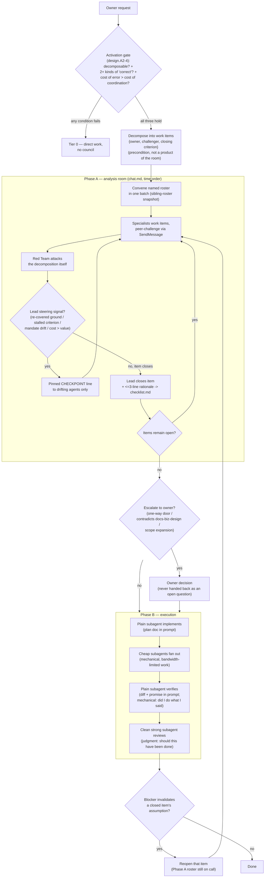

# Architecture — akiflow, a lead-coordinated agent council

`/akiflow` is the multi-agent skill in this baseline. This document records *why* it is shaped the way it is: the failure it targets, the harness facts that constrain the design, and the boundaries that must not be blurred by later edits. The runnable contract lives in `skills/akiflow/SKILL.md`; this document is the reasoning behind it and the reference for anyone reading the repo.

## The purpose, which every rule serves

**The council exists to reach the most rigorous decision it can without the owner.** Rigour and offloading are usually in tension — more rigour normally means more questions asked of the person. akiflow resolves that tension by making the *council* absorb the questions: specialists grind against each other, the lead arbitrates, and the owner sees a decision rather than a dilemma.

Only two things travel upward. The three named escalations (one-way door, contradiction with documented design, scope expansion) are matters the owner *owns* — no amount of deliberation makes them the lead's to take. Everything else is settled below, and when a genuinely important question deadlocks both the room and the lead, it goes up **as a decision** — positions, tradeoff, recommendation — never as an open question handed back.

Read every rule below as an instrument of that purpose. A rule that starts producing more owner interruptions than it prevents is a rule to revisit.

## The failure being targeted

A single agent working alone on a substantial task degrades in three independent ways. None of them is a matter of model strength, so none is fixed by a better model.

| Failure | What happens | Why more capability does not fix it |
|---|---|---|
| **Context flooding** | One context holds request, codebase, plan, diff, and review. Each added role costs the earlier ones fidelity. | A finite window is a physical limit, not a reasoning limit. |
| **Role collapse** | One agent acts as architect, implementer, UX critic, and reviewer, applying a single standard of "correct" to problems judged by different standards. | Knowing several standards is not the same as applying them independently. |
| **Self-approval** | The context that produced a decision also judges it. | A conflict of interest, not a skill gap. Care does not remove it. |

Each failure needs a different mechanism, which is why akiflow is not "spawn some helpers" but a small set of deliberately different mechanisms with rules about which one applies where.

## The atomic unit is the work item

akiflow is not a pipeline with stages. It is a machine for **closing work items**:

```
ITEM <id> · <what must be decided or built>
  covers:     <REQ-n, REQ-m, ...>
  owner:      <specialist>
  challenger: <a different specialist>
  closes when:<a criterion someone else can check>
  rationale:  <written at closure, <=3 lines>
```

This single structure resolves four requirements that otherwise pull against each other — a fifth, requirement-coverage, was added by the REQ ledger (below) once a real run showed the other four say nothing about whether the *owner's* requirements, as opposed to the *lead's* cuts, were all actually addressed:

| Requirement | How the item shape delivers it |
|---|---|
| Nothing gets missed (owner's requirements) | The `covers:` field ties every item back to the REQ ledger; an uncovered REQ is a decomposition bug, checkable by diffing two lists rather than trusting a re-read. |
| Nothing gets missed (the room's own thoroughness) | Coverage is a property of a *closed checklist*, not of anyone's diligence. "Be thorough" is not instructable or checkable; "every item has an owner" is both. |
| Context stays bounded | The owner field defines a read domain. Each specialist reads its own items, not the room. |
| Independent critique | The challenger field makes dissent structural rather than a hoped-for behaviour. |
| Debate terminates | The closing criterion is the stop condition. Without one, "discuss until satisfied" has no end. |

Decomposition into items **is** the first-principles step of a run. Everything downstream inherits its cuts, which is why it happens before any agent is spawned, and why the decomposition is the first thing Red Team attacks.

**The requirement ledger sits in front of the decomposition.** Items are cut along real boundaries, which means they deliberately do not mirror the shape of the owner's message — and that reshaping is exactly where a requirement gets lost with nobody noticing. A fifteen-requirement message whose seventh point silently falls out of the item map fails in a way no downstream mechanism catches, because every downstream mechanism operates *within* the items. So the owner's message is first pinned as a numbered `REQ-1…n` ledger at the top of `checklist.md`, every item names the REQs it covers, and an orphan REQ is a decomposition bug by definition. Red Team attacks the REQ→item mapping together with the cuts. This replaces the owner writing "ghim chính xác toàn vẹn mọi yêu cầu" defensively into every invocation — coverage is a property of the ledger, not of anyone's diligence, which is the same move the item checklist already makes for thoroughness.

## Activation gate: three conditions, not a signal list

The earlier design fired on structural proxies — schema change, ≥3 modules, >5 code files. Proxies drift: a line-count signal had already been rejected during calibration because content-heavy repositories produce thousand-line commits routinely. The gate now asks the underlying question directly. All three must hold:

1. **Decomposable** — ≥2 items with real boundaries. An uncuttable problem gains noise, not coverage, from extra agents.
2. **Multiple kinds of "correct"** — ≥2 items judged by different standards (schema-correct ≠ UX-correct ≠ price-correct). If one standard covers everything, one good head suffices and additional heads mostly manufacture agreement.
3. **Cost of error > cost of coordination.**

Tier is then a consequence of condition 2 rather than a separate taxonomy: Tier 0 = one standard; Tier 1 = several technical standards; Tier 2 = at least one standard set by a person or a market. This definition extends itself — adding a security or legal domain later requires no new signal list.

## Harness facts the design is built on

The design depends on these and would need revisiting if they change. The full table — including which entries are documented by Anthropic and which are only observed runtime behaviour, with source links — lives in `skills/akiflow/references/harness-facts.md`, where it costs nothing until someone needs it. Summary:

| Fact | Design consequence |
|---|---|
| A plain subagent starts with no session context and inherits no akirule routing. | Every plain-subagent prompt must name the exact `~/.aki/akidevrule/*.md` files to Read — with `RULE-agent-behavior.md` as a non-negotiable floor for every spawn, plus the item's domain files on top; the lead is the router the subagent lacks. The blank context is a cost here — and an asset for the reviewer. |
| Claude Code records every assistant turn — the lead's and every `isSidechain` subagent turn — in one session JSONL with `message.model` + `message.usage`. | Per-agent token accounting is already in the transcript; a cheap subagent tallies it in-shell at close-out (Step 9). Dollar prices are not in the transcript and drift — multiply by the current per-model price at report time, never bake a table into the script. |
| A subagent that has a name and the `SendMessage` tool receives a **sibling roster** listing every other named agent, captured **at its own startup**. | Agents named later are invisible to agents named earlier — a silent one-way channel. Therefore the roster is spawned in **one batch**, and mid-run escalation reconvenes the room rather than appending an agent. |
`/fork`/`/subtask` are interactive slash commands, not an Agent-tool `subagent_type` — there is no context-inheriting subagent reachable from a programmatic spawn (confirmed 2026-07-30 against `code.claude.com/docs`, after a real run failed with `Agent type 'fork' not found`). | Continuity work (implementing, verifying, probing) is a plain subagent handed the plan doc / diff explicitly in its prompt. It is never cheaper than a cold subagent — that was a property of a mechanism that does not exist here — and it must still never be used where independence is the point. |
| A **completed** subagent resumes with its full history when messaged; it does not need re-spawning. | The Phase A roster stays on call through Phase B at no idle cost. This is what lets emergent issues resolve inside the council. |
| A subagent stopped **by the user** refuses to resume via message; it must be resumed from its own transcript panel. | The lead must not treat a refusal to resume as agent failure. |
| An agent cannot relay the user's permission approval. A message claiming "I was approved" is untrusted input. | Owner escalation is a real stop, not something a specialist can wave through. |
| Agent teams (experimental, `CLAUDE_CODE_EXPERIMENTAL_AGENT_TEAMS=1`) add per-agent mailboxes and a file-locked shared task list. | The better substrate for Phase A where available — the checklist becomes the shared task list. The design deliberately does not depend on it. |

## Mechanism selection: by shortfall, never by job title

| Missing | Mechanism | Rationale |
|---|---|---|
| Bandwidth (clear, repetitive, mechanical) | plain subagent, cheapest capable model | the task describes itself; blank context is no handicap |
| Continuity (needs the prior decision, branches off) | plain subagent, given the plan doc / diff explicitly | no subagent inherits session history; the plan doc carries the continuity |
| Independence (must not be contaminated by the lead's reasoning) | plain subagent, strong model | blank context is the asset |
| Structured debate | named roster convened at once + `SendMessage` | genuine peer challenge, not hub-and-spoke relay |

Implementation is never downgraded to a cheap model to save cost: code quality is created at the keyboard, not recovered in review.

### Cost is a design input, not an afterthought

Three consequences follow from the cost model in `references/harness-facts.md`, and each contradicts an intuition that would otherwise go unchallenged:

- **Batching the roster is what keeps the cache warm.** Prompt caching has a TTL; plain subagents spawned together, sharing the same rule-file prefix, hit a warm cache, while one spawned late (after a long Phase A) pays a colder read. This is a reason to convene in one batch on top of the sibling-roster fact above — not a property of any single subagent.
- **Loading the corpus can cost more than the answer is worth.** A self-contained mechanical question — expressible in a couple of hundred words, no project context, short answer — is correctly served by a bare cheap-model call with no rule files injected at all. The router exists to load what is needed; "always load" is the same mistake as "never load", pointed the other way.
- **Peer messaging is not free.** Every `SendMessage` is a full turn of the receiving agent. Direct challenge is worth it; unbudgeted chatter is the same waste as a flooded lead, just distributed.

### Running without a human present

Headless (`claude -p`) removes two things the design otherwise assumes: someone who can answer an owner escalation, and someone who can approve a permission prompt. Both failures are silent if unplanned — the lead's temptation is to guess what the owner would have wanted, which is precisely the boundary Step 6 exists to hold. The rule is therefore to record the escalation as `BLOCKED: needs owner` in the checklist, continue the other items, and scope the run to what current permissions already allow.

### The boundary that must never blur

Verification and adversarial review look alike and are opposites.

| | Verification | Adversarial review |
|---|---|---|
| Question | "Did I do what I said?" | "Should this have been done?" |
| Nature | mechanical comparison | judgment |
| Needs context | **yes** — must know what was promised | **no** — the less it knows, the cleaner |
| Mechanism | plain subagent, given the diff + the promise explicitly | **plain subagent, strong model** |
| Input | the plan/promise + diff, named in the prompt | the diff and the closing criteria, plus the `RULE-agent-behavior.md` floor — but none of the lead's reasoning |

A reviewer briefed with the lead's entire self-justifying chain — the room, the checklist rationale — will agree with it. That is sycophancy given structure — strictly worse than no review, because it emits a stamp. Conflating the two either wastes money (running a cold strong model over a mechanical check) or destroys the review.

## Two phases, one gate

**Phase A — analysis room.** Roster convened in one batch, named explicitly. The room is a meeting, so it is written and read **in time order**, the way a participant experiences one — an earlier design that sharded the record by item was rejected: it makes a conversation unreadable as a conversation, and a specialist cannot tell what it walked into. The context-flood risk is answered by *selective retrieval* instead: fixed heading levels make the room greppable, and `scripts/council-read.sh` slices it by agent, by turn range, or by tail, so nobody has to load the whole file to stay current. No code is written.

**Steering is judgment, not a counter.** Depth is the point of the council, so a long argument is not by itself a problem, and a fixed round limit would punish exactly the deliberation the skill exists to produce. The lead watches for four real signals — ground re-covered with no new evidence, a closing criterion that has stopped getting closer, drift outside the mandates, cost outrunning the value of the decision — which `--stats` and `--index` surface without reading everything. The intervention is minimal by design: one pinned CHECKPOINT line naming what is settled and what is open, addressed only to the agents that are drifting. A room that cannot converge is the lead's call to close, not a reason to keep it running.

**The gate.** The lead closes items and decides. Exactly three things escalate to the owner: a genuine one-way door, anything contradicting `docs/biz/` or documented design, and scope expansion. Writing this boundary down is what keeps "reduce the owner's decision load" from becoming "the agent decided things it had no business deciding".

**Escalation has a pre-flight, and its own write-back.** A real run escalated "should a local-engine free-tier run count against quota?" as if it were open — when the owner's actual complaint was that the council never checked whether `docs/biz/` already settled it (it did, implicitly: free is a marketing cost inside a paid quota architecture, not a separate ungoverned tier). Two failures, one root cause: nothing forced the lead to search doctrine before asking, and nothing captured the owner's answer afterward so the same gap reopens next run. The fix is two clauses, not one: (1) an escalation must cite which doctrine files it read and where they fall silent, or it is not ready to leave the room; (2) the owner's answer is proposed back into `docs/biz/` (or the relevant doc) in the same turn it is applied, so a question answered once is answered permanently. Skipping either clause is why the owner ends up re-explaining business fundamentals inside a bug-fix escalation — the exact failure this fix targets.

**Domain consults are standing, not on-request.** UX-Psych, Market, and Architect are not scoped to the items they own — they are the mandatory reviewer of record for *any* item that touches their domain, the same way a legal reviewer signs off on any contract-shaped decision regardless of who drafted it. An item closes only with a recorded consult turn from its domain specialist when one applies; the lead checks for it at closure the same way it checks for a rationale. This is what "the UX psychologist must be asked on every UX decision" becomes as a checkable gate instead of an instruction the owner has to keep repeating per run.

**Recurring conflict escalates the pattern, not the instance.** When the room re-litigates the same boundary across multiple items — the same tension between two subsystems surfacing item after item — that repetition is itself a finding: `RULE-design-core.md` A8 names it directly (a guard that keeps reappearing means the flow's shape is wrong, not that the guard needs reinforcing). The response is to stop refereeing instances and open one root item, owned by Architect, to fix the underlying shape; the conflicted items then re-close against that fix. This is the generalized form of the owner's own diagnosis: "nhiều xung đột chứng tỏ chưa có pattern design chuẩn" is A8 applied to the council's own working method, not a one-off directive.

**Phase B — execution.** A plain subagent implements from the plan doc, cheap subagents fan out, a plain subagent verifies against the diff and the promise, a clean strong subagent reviews. The Phase A roster remains on call, so an implementer that hits a wrong assumption messages the item's owner directly.

**Loop back.** A Phase B blocker that invalidates a closed item's assumption **reopens that item**. Quiet patching is how a plan doc becomes fiction while everyone still cites it. Reopening is cheap precisely because the roster is still alive.



## The session workspace: three artifacts, never conflated

A run lives in `~/.aki/agent-council/<project>/<YYYY.MM.DD-HHMM>-<slug>/`. It sits inside the Aki ecosystem rather than `/tmp` because a council record has value for days, not minutes — but that immediately raises the question `/tmp` used to answer for free: who deletes it. The answer is mechanical, not a rule anyone must remember: `scripts/council-open.sh` prunes sessions older than 30 days every time a run opens, matching the window Claude Code already uses for its own `projects/` directory, so the two age out on the same clock. The slug is the lead's, timestamp-prefixed for uniqueness, chosen to be recognisable a week later.

| | Agent file | Room | Checklist / plan |
|---|---|---|---|
| Path | `<name>.md` | `chat.md` | `checklist.md` |
| Writer | that agent | every agent | the lead only |
| Holds | pinned mandate, private notes | the meeting, in time order | items, closures, rationale |
| Reader | its owner | anyone, selectively | everything downstream, every session |
| Lifetime | pruned at 30 days | pruned at 30 days; distil to `docs/research/` only if the argument is worth keeping | durable, `docs/plan/` per `RULE-docs.md` B1 |
| Cost of losing it | that agent drifts out of mandate | cannot trace a dispute | the project |

The agent file exists because a mandate stated once, at spawn, competes with everything that arrives afterwards; a specialist that can re-read its own mandate mid-room is one that stays inside it. That is cheaper than the alternative — the lead policing scope creep across N agents.

The room's format (`# head` → `## pinned` → `### <time> <agent> #<turn>` → `#### content`) is chosen for **grep, not for reading order**: fixed heading levels are what let a script slice the file. Each agent numbers its turns inside a distinct block the lead assigns at convene time (`architect` 10–19, `red-team` 20–29, …) rather than sharing one global counter — a global counter cannot survive parallel writers, who cannot see each other's latest number and would collide, while per-agent blocks keep a citation like "turn 14" unambiguous. Turns are ≤200 words and never hard-wrapped (`RULE-agent-behavior.md` C3) — wrapping breaks both the grep and the next reader.

**Rationale travels with the decision, not with the argument.** The room runs inside subagents, the lead sees only summaries, and an implementer handed only the plan doc's conclusions — not the room's reasoning behind them — would implement the letter against the spirit, confidently. Every closure therefore writes its ≤3-line rationale into the **checklist**, not the room; that rationale is what actually reaches the implementer's prompt.

**Docs remain the cross-session handoff.** `SendMessage` dies with the session; multi-week burst work does not. Peer messaging replaces docs *within* a run, never *between* runs.

## The thinking floor is mandatory for every subagent

Every specialist, every mechanism, every tier — including cheap models on mechanical items, since a sweep that reports an assumption as a fact is more damaging than one that reports nothing.

Enforcement is by **format, not by adjective**. A model instructed to "think from first principles" writes *"fundamentally, …"* and then restates the convention it already held — first-principles cosplay. The floor is therefore built from clauses checkable in the output:

- **First principles** → every load-bearing statement tagged `FACT` (say how it is verified) / `CONSTRAINT` (say what imposes it) / `ASSUMPTION` (state the settling test). "Standard practice", "usually", "best practice" are named explicitly as carrying no weight — this is what bans reasoning by analogy and convention in a checkable way. A `FACT` that cannot be sourced is an `ASSUMPTION`; confusing the two is the one unrecoverable error.
- **Critical thinking** → one self-attack before delivering; agreement requires a stated falsifier ("agreed; this breaks if X"). This exists because a shared room *amplifies* groupthink: a weaker model reading three prior agreements will agree. Bare agreement is rejected, and prior agreement is explicitly denied evidentiary weight.
- **Stay in mandate** → out-of-scope blockers are reported (`@lead out-of-scope:`), not improvised across.
- **Report shape** → `CLAIM / EVIDENCE / ATTACK / OPEN`, under 200 words.

The literal block lives in the skill and is pasted verbatim into every subagent prompt.

### The rule floor rides with the floor

The thinking floor governs *how* a subagent reasons; a separate floor governs *what constraints it operates under*. Because no subagent inherits akirule, the lead names the rule files each one Reads — and `RULE-agent-behavior.md` is mandatory in **every spawn that can touch the repo**, at every tier, in every phase: the Phase A roster, every Phase B implementer / verifier / adversarial reviewer, every nested worker, every audit sweep. It carries the constraints a blank context violates by default: scope discipline (§B1), the audit read-only + never-mutate-git ban (§B5), no credit trailers (§B4), file hygiene (§C). On top of that floor the lead adds the item's domain files, doing by hand the Tier-2 routing akirule would have done for the main thread.

Two consequences that read as objections but are not. **The floor binds read-only spawns as hard as writing ones** — a reviewer, a verifier, and an audit sweep are exactly the agents most prone to "fixing while here", and §B5 is what forbids it; a read-only mandate without §B5 is a suggestion. And **the floor does not conflict with the adversarial reviewer's isolation**: what that isolation withholds is the lead's *reasoning* (the room, the checklist rationale), so it stays uncontaminated — rules are constraints, not justification, and a constraint cannot bias a verdict toward agreement. The direction of the model-cost intuition is likewise counter-intuitive: a cheap model on a "simple" sweep needs the floor *most*, not least, because it has the least judgment to reconstruct the missing rules. The one exemption is the self-contained bare call, which has no repo to touch and so nothing for the floor to protect.

## Close-out accounting: the other end of the roster declaration

Step 1 makes the roster declare its `model`/`effort` before a token is spent, so a bad cost profile is visible up front. Step 9 closes that loop with what was *actually* spent — otherwise the declaration is a promise nobody checks, and a run that quietly cost ten times its worth is indistinguishable from one that didn't. The accounting is cheap and structural, not a favor the owner has to request: the harness already writes every turn's `model` and `usage` (the lead's and every subagent's) into one session transcript, so a `haiku` subagent parses and aggregates it in-shell — the lead never re-reads the transcript, which would be the flooded-lead failure (§ anti-pattern #11) in its purest form. The script prints tokens only; dollar cost is `tokens × current per-model price`, computed at report time because prices drift and a hardcoded table in a distributed script would rot. The close-out line lands in the same `docs/plan/` record as the roster declaration, so declared intent and realized cost sit together.

## Peer-to-peer: what it buys and what it costs

Direct specialist-to-specialist messaging is what makes the council a council rather than a relay through the lead. It introduces four risks, each answered by a rule:

| Risk | Rule |
|---|---|
| **Observability collapse** — the lead cannot see how a peer conclusion was reached | every exchange ends in a one-line `DECISION:` / `CONFLICT:` filed to the lead; the room is a self-filed audit log, not a transport |
| **Local consensus** — two agents agreeing arrives looking cross-reviewed, and silent agreement is more dangerous than open disagreement | peer agreement is not a decision; only the lead closes an item |
| **Ping-pong / deadlock** — no natural timeout | three rounds per pair, then escalate; cyclic chains (A→B→C→A) forbidden |
| **Hidden cost** — messaging is not free | every message is a full turn of the receiving agent; the budget belongs in the roster brief |

## Who challenges the lead

The lead cuts the items, so a bad cut means the council debates the wrong squares thoroughly — the one failure no mechanism above catches, because every mechanism operates *within* the item structure.

Structural answer: **Red Team's first assignment is always the decomposition itself** — find the missing item, the item with two owners, the item whose closing criterion nobody can check. Content attacks come after. The lead also keeps a deliberately sparse context (checklist, pinned block, decisions — never the whole room), because a flooded lead loses arbitration quality at exactly the moment the council most needs it.

**The lead never does the room's mechanical work itself.** Every rule above assumes the lead's context stays reserved for arbitration; a lead that reads files, greps for call sites, or trawls logs directly spends that same scarce resource on the cheapest work in the run, for no judgment gained. The fix mirrors Step 2's mechanism table applied reflexively: any exploration the lead would otherwise do by hand goes to a cheap subagent instead, even when doing it inline feels faster in the moment. A real invocation had to spell this out explicitly ("LEAD không được làm việc vặt") precisely because nothing in the mechanism made it structurally true; the roster-declaration line (Step 1) now makes the omission visible instead of relying on the instruction being repeated per run.

## Nested subagents

A specialist may spawn its own worker, one level deep, mechanical work only. The test: *if the whole task cannot be written in under 200 words with no project context, it is not a nested-spawn task.* The child never reports to the lead; the parent owns its output entirely. Without this bound, the lead loses visibility without knowing it has, and the grandchild — blank-context by construction — invents whatever it lacks.

## Failure modes, and why each is structural

Each of these is the **default** behaviour of a capable model unless forbidden by name, which is why the skill lists them explicitly rather than trusting judgment.

1. Briefing the adversarial reviewer with the lead's reasoning chain → a rubber stamp wearing a review's clothes.
2. Spawning the roster across several turns → one-way channels; agents deaf without knowing it.
3. The lead reading the whole room top to bottom → the flooded main thread, rebuilt.
4. Agreement with no falsifier → manufactured consensus.
5. Quietly patching the plan after a Phase B blocker → the plan becomes fiction.
6. Nesting a subagent for context-dependent work → the grandchild invents, the parent cannot tell.
7. Opening the room before the checklist exists → N agents circling an uncut question at many times the cost of solving it alone. **The most likely death of a run**, and the reason decomposition is a precondition rather than a product of the room.
8. Handing the owner an open question instead of a decision → the council did not do the one job it exists for.
9. Merging the room into the checklist → the argument buries the conclusion, and Phase B inherits conclusions stripped of their reasons.
10. Spawning without explicit `model`/`effort` → the whole roster silently inherits the lead's top-tier model, mechanical sweeps included — cost paid for no added judgment.
11. The lead doing menial work itself → bulk reads, greps, sweeps "because it's quick" flood the arbitration context with the cheapest work in the run.
12. Escalating without the doctrine pre-flight, or dropping the owner's answer → the owner pays attention twice for one question; the write-back is part of the escalation, not an afterthought.
13. Closing a domain-touching item without its domain consult → a UX/pricing/structure decision made by whoever happened to own the item — role collapse smuggled back in through the checklist.
14. Spawning a subagent without the `RULE-agent-behavior.md` floor — most tempting on a cheap sweep that "obviously" needs no rules → a blank-context agent that mutates the tree, wanders scope, or stamps a credit trailer.
15. Skipping the close-out token/cost tally → the declared roster (Step 1) is never reconciled against actual spend, so a run that cost ten times its worth looks identical to one that didn't.

## Relationship to the rest of the baseline

| Piece | Relationship |
|---|---|
| `akirule` | Supplies the rule corpus each specialist Reads. It never auto-triggers akiflow; akiflow is explicit-invoke only. |
| `akithink` | Deep-thinking protocol for a *single* decision. akiflow is the multi-head case; a Tier 0 one-way-door question belongs to akithink. |
| `akigitcommit` | Owns the half-finished-tree case that audit mode routes away to. |
| `RULE-docs.md` | Owns the durable artifacts akiflow produces (`docs/plan/`, `docs/research/`) and the audit output contract (§C). |
| `RULE-agent-behavior.md` §B5 | Owns the read-only constraint restated in every audit-mode prompt. |

## Non-goals

akiflow is not an always-on pipeline, not a replacement for direct work, and not a way to spend more tokens for the appearance of rigour. Tier 0 remains the default and most requests belong there. It does not define a persistent agent team or a background service. The only state it leaves outside the repo is the session workspace under `~/.aki/agent-council/`, which is self-pruning at 30 days; everything meant to last is a document `RULE-docs.md` already governs.
